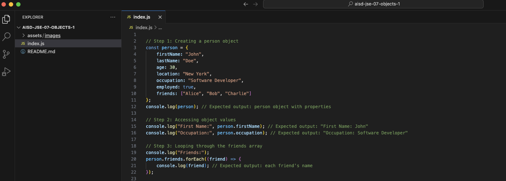

# JavaScript Basics: Objects


## Description 📄
In this project, you will practice working with objects in JavaScript. You will create a `person` object with properties like `firstName`, `lastName`, `age`, `location`, `occupation`, `employed`, and an array of `friends`. You will also learn how to access the values of the object and loop through the `friends` array to print each name. This hands-on experience will help you understand the practical applications of objects in managing structured data.

## Expected Project Structure 🏗️
Your project will have the following structure:
```
ObjectsPartOne/
└── index.js
```

# Instructions ✅

## 1. **Create the Project Folder and File**
You will begin by setting up your project structure.

- [ ] Create a folder named `ObjectsPartOne` to store your project files.
- [ ] Inside the `ObjectsPartOne` folder, create a file named `index.js`. This file will contain all your JavaScript code.

## 2. **Create a Person Object**
You will start by creating an object to represent a person.

- [ ] In your `index.js` file, add the following code to create a `person` object with the specified properties:

```javascript
// Step 1: Creating a person object
const person = {
    firstName: "John",
    lastName: "Doe",
    age: 30,
    location: "New York",
    occupation: "Software Developer",
    employed: true,
    friends: ["Alice", "Bob", "Charlie"]
};
console.log(person); // Expected output: person object with properties
```

- [ ] Run your JavaScript file in the terminal with the command `node index.js` to see your object.

**Expected Output:**
```
{
    firstName: "John",
    lastName: "Doe",
    age: 30,
    location: "New York",
    occupation: "Software Developer",
    employed: true,
    friends: ["Alice", "Bob", "Charlie"]
}
```

**Explanation:**
- The variable `person` holds an object containing various properties that describe a person, including their name, age, location, occupation, employment status, and an array of friends. Each property can be accessed using the dot notation or bracket notation, allowing for easy retrieval and modification of values.

## 3. **Accessing Object Values**
Next, you will learn how to access the values of the properties in your `person` object.

- [ ] Update your `index.js` file with the following code to log the `firstName` and `occupation`:

```javascript
// Step 2: Accessing object values
console.log("First Name:", person.firstName); // Expected output: "First Name: John"
console.log("Occupation:", person.occupation); // Expected output: "Occupation: Software Developer"
```

- [ ] Run your JavaScript file to see the output.

**Expected Output:**
```
First Name: John
Occupation: Software Developer
```

**Explanation:**
- The first console.log statement prints the label "First Name:", followed by the value of person.firstName, which is accessed using dot notation. This returns "John".
- The second statement does the same for the occupation property, displaying "Occupation:" followed by the value, which is "Software Developer".
- Accessing properties with dot notation is essential for working with objects in JavaScript.

## 4. **Looping Through the Friends Array**
Now, you will loop through the `friends` array within the `person` object and print each friend's name.

- [ ] Add the following code to your `index.js`:

```javascript
// Step 3: Looping through the friends array
console.log("Friends:");
person.friends.forEach((friend) => {
    console.log(friend); // Expected output: each friend's name
});
```

- [ ] Run your JavaScript file to see the output.

**Expected Output:**
```
Friends:
Alice
Bob
Charlie
```

**Explanation:**
- The `console.log("Friends:");` prints the label "Friends:" to indicate that the subsequent output will list friends' names.
- The `person.friends.forEach((friend) => { ... });` line uses the `.forEach()` method to loop through each element in the `friends` array, where friend represents the current element.
- The `console.log(friend);` statement prints each friend's name, displaying them on new lines.

## 5. **Testing Your Knowledge**
Consider adding more properties to the `person` object, such as hobbies or favorite foods, and practice accessing and printing these new properties.

## 6. **Commit and Push to GitHub**
Ensure you commit your work to your local Git repository and push it to GitHub.

# Conclusion 📄
In this project, you learned how to create and work with objects in JavaScript. You practiced creating an object, accessing its properties, and looping through an array contained within the object. These foundational skills will help you manage structured data effectively in your JavaScript programs.

---

### Solution Codebase 👀
🛑 **Only use this as a reference** 🛑

💾 **Not something to copy and paste** 💾

**Note:** This lab references a solution file located [here](https://github.com/HackerUSA-CE/aisd-jse-07-objects/tree/solution) (link not shown).


© All rights reserved to ThriveDX